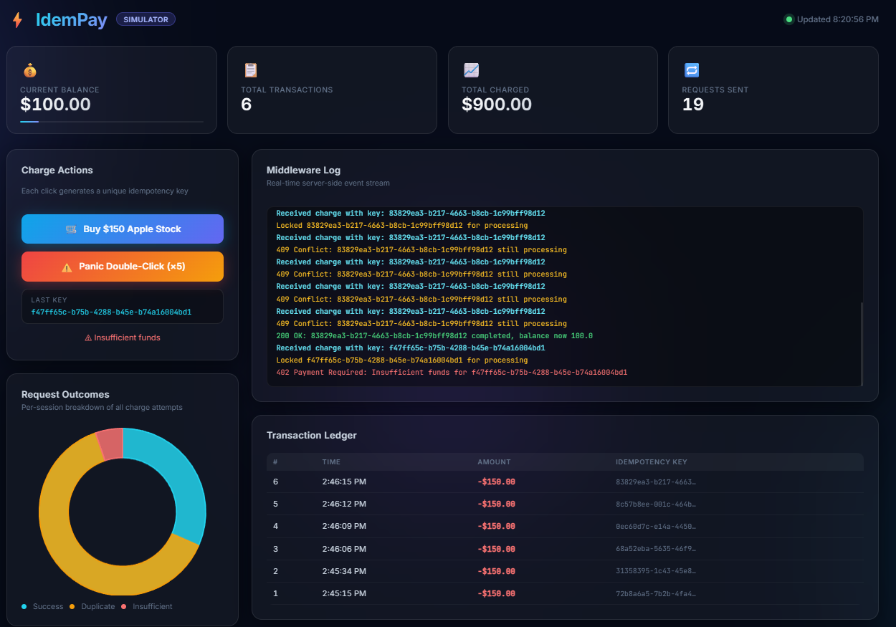

# A Deep Dive into Idempotent Transaction Design

---

## Introduction

Have you ever double-clicked a "Pay Now" button and immediately panicked — wondering if you just got charged twice? In the world of consumer apps, that's annoying. In banking infrastructure, it can mean regulatory violations, reconciliation nightmares, and very unhappy customers.

Working in financial technology, I operate in an environment where payment requests don't always travel in a straight line. Networks drop. Services retry. Mobile clients resend. The question isn't *if* a duplicate request will arrive — it's *when*. And the system needs to be ready.

This post walks through **IdemPay**, a payment gateway simulator I built to demonstrate idempotency in action: a FastAPI backend with a SQLite transaction ledger, an in-memory concurrency lock, and a live dashboard that lets you fire off duplicate requests and watch exactly what happens.



Whether you're a backend engineer, a fintech enthusiast, or someone curious about how banks prevent double charges — this one's for you.

---

## Why Does This Matter?

Modern payment systems are distributed. A charge request might be retried by a client SDK, replayed by a message queue, or duplicated by a load balancer failover. Without idempotency, each of those retries could trigger a new debit.

The classic horror story: a mobile banking app loses its network connection mid-request. The client doesn't know if the charge went through, so it retries. The server processes it again. The customer is now charged twice. Nobody wins.

**Idempotency** is the guarantee that no matter how many times the same logical request is received, the effect on the system happens exactly once. It's a foundational principle in payment APIs — Stripe, PayPal, and most core banking platforms enforce it at the API layer.

Building a simulator of this system from scratch forced me to think about every layer where this can go wrong — and where the database is the last line of defense.

---

## Project Overview

**Goal:**
Simulate an idempotent payment API where concurrent duplicate requests are safely blocked, replayed, or rejected — and visualized in real time.

**Tech Stack:**

| Layer | Technology |
|---|---|
| API Framework | FastAPI (Python) |
| Database / Ledger | SQLite + SQLAlchemy ORM |
| Concurrency Control | Python `threading.Lock` (in-memory) |
| Frontend Dashboard | Vanilla JavaScript + Chart.js |
| Templating | Jinja2 |
| Server | Uvicorn (ASGI) |

---

## System Architecture

The core flow of every charge request through the system:

```
Incoming POST /charge (with Idempotency-Key header)
        │
        ▼
┌───────────────────────┐
│  Idempotency Middleware │
│  (in-memory lock)      │
└───────────┬────────────┘
            │
     ┌──────┴───────┐
     │              │
  Key seen?      New key
     │              │
  ┌──┴───┐     Lock + mark
  │      │     "processing"
Still  Already        │
 proc.  done          ▼
  │      │     Simulate work
409    200      (2s async delay)
Conflict Replay       │
                      ▼
               Write to SQLite
               (unique key constraint)
                      │
                      ▼
               Mark "completed"
               Return 200 OK
```

The in-memory store handles speed. The database `UNIQUE` constraint on `idempotency_key` handles correctness — even if the in-memory state is ever lost or bypassed.

---

## Project Structure

```
idempay/
├── main.py              # FastAPI app, startup seeding, router registration
├── api.py               # /charge, /ledger, /log endpoints
├── db.py                # SQLAlchemy engine and session factory
├── models.py            # User and Transaction ORM models
├── idempotency.py       # In-memory store + threading lock
├── requirements.txt
├── templates/
│   └── index.html       # Jinja2 template (served at /)
└── static/
    ├── app.js           # Frontend logic, polling, chart
    └── style.css        # Dark theme UI
```

---

## Component Walkthrough

### 1. `models.py` — The Schema That Enforces Correctness

**What it does:**
Defines two SQLAlchemy models: `User` (holds name and balance) and `Transaction` (records every charge with its idempotency key, amount, and timestamp).

The most important line in the entire project:

```python
idempotency_key = Column(String, unique=True)
```

**Why?**
The `unique=True` constraint on the `idempotency_key` column is the final safety net. Even if the in-memory lock somehow fails — say, in a multi-worker deployment — the database itself will reject a second insert with the same key, raising an `IntegrityError`. This is how you build systems that are correct by construction, not just by convention.

---

### 2. `db.py` — Engine Setup and Reset Utility

**What it does:**
Creates the SQLAlchemy engine pointed at a local SQLite file (`ledger.db`), and exposes a `SessionLocal` factory for creating database sessions. Also provides a `reset_database()` utility that drops and recreates all tables.

```python
engine = create_engine(SQLALCHEMY_DATABASE_URL, connect_args={"check_same_thread": False})
```

**Why?**
`check_same_thread: False` is required for SQLite in an async context — FastAPI handles requests across threads, and this setting permits that. In a production banking context, you'd swap SQLite for PostgreSQL and use connection pooling, but the pattern is identical.

---

### 3. `idempotency.py` — In-Memory Lock and State Store

**What it does:**
Maintains a simple Python dictionary (`idempotency_store`) and a `threading.Lock`. Every incoming request checks this store before touching the database.

```python
idempotency_store = {}
idempotency_lock  = threading.Lock()
```

Possible states for a key in the store:

| State | Meaning | Response |
|---|---|---|
| Not present | New request | Proceed, lock it |
| `"processing"` | In-flight request | 409 Conflict |
| `"completed"` | Already done | 200 Replay cached result |

**Why?**
The lock prevents a race condition where two simultaneous requests with the same key both read "not present" and both proceed to write. Without the lock, you'd have a classic check-then-act race — the exact scenario the panic button tests.

---

### 4. `api.py` — The Core Charge Endpoint

**What it does:**
Implements three endpoints: `POST /charge`, `GET /ledger`, and `GET /log`. The charge endpoint is where all the interesting logic lives.

Step-by-step flow of `POST /charge`:

1. Read the `Idempotency-Key` header. Reject with 400 if missing.
2. Acquire the threading lock and check the in-memory store.
3. If the key is `"processing"` → return 409 immediately.
4. If the key is `"completed"` → return the cached 200 payload (no DB hit).
5. If the key is new → mark it `"processing"` and release the lock.
6. Simulate processing delay (`await asyncio.sleep(2)`).
7. Open a DB session, check balance, deduct $150, write the `Transaction` row.
8. Mark the key `"completed"` in the store with the response payload.
9. Return 200 with the updated balance.

**Why?**
The 2-second async delay is intentional — it's the window during which duplicate requests will arrive in the panic test. Real payment processors have similar windows during fraud checks, downstream service calls, or ledger commits. This is where most duplicate-charge bugs happen in practice.

---

### 5. `main.py` — App Bootstrap and State Reset

**What it does:**
Initializes the FastAPI app, mounts static files and templates, and wires up the API router. On startup, it drops and recreates all tables, seeds Alice with $1,000, clears the idempotency store, and resets the event log.

**Why?**
The `on_startup` event guarantees a clean slate every time the server restarts — important for a simulator where you want repeatable demos. In production, this would obviously be replaced with proper migrations (Alembic) and persistent state.

---

### 6. Frontend (`app.js` + `style.css`) — Live Dashboard

**What it does:**
A vanilla JS frontend that polls `/log` every 700ms and `/ledger` every 1200ms. Renders a real-time middleware log terminal, a transaction table, four stat cards, and a Chart.js doughnut breaking down outcomes (Success / Duplicate Blocked / Insufficient Funds).

Two key buttons:

- **Buy $150 Apple Stock** — fires a single charge with a fresh UUID
- **Panic Double-Click (×5)** — fires 5 simultaneous `Promise.all` requests with the *same* UUID

**Why?**
The polling approach is intentionally simple — no WebSockets, no SSE. For a simulator, this is fine. The panic button is the educational centerpiece: it creates exactly the kind of concurrent duplicate scenario that real retry logic produces.

---

## The Database Layer: Why It's the Source of Truth

This is the part I find most relevant to banking systems work.

The in-memory idempotency store is fast and elegant, but it has a critical weakness: it doesn't survive process restarts, and it doesn't work across multiple server instances. Scale this app to two workers behind a load balancer and the in-memory lock becomes useless — both workers have independent stores.

The database is what makes the system *actually* safe. Two properties work together:

**1. The `UNIQUE` constraint as a hard guarantee:**
The `idempotency_key` column has a database-level unique constraint. If two workers both somehow pass the in-memory check and both attempt to insert a transaction with the same key, one will succeed and the other will receive an `IntegrityError`. The database enforces exactly-once semantics at the storage layer — no application logic required.

**2. The transaction ledger as an audit trail:**
Every successful charge is a permanent, timestamped row. In regulated banking environments, this immutability is not optional — it's required by frameworks like SOX and various AML regulations. Even if the application layer is uncertain about whether a charge went through, the ledger is the authoritative record.

In production systems at scale, this pattern graduates to distributed locks (Redis `SET NX`), idempotency tables in Postgres with row-level locking, and event sourcing. But the core principle — the database as the final arbiter of truth — stays constant.

---

## Setup: Try It Yourself

**1. Clone the repo and install dependencies:**

```bash
git clone https://github.com/ArchitJoshi7/payment-gateway
cd payment-gateway
pip install -r requirements.txt
```

**2. Start the server:**

```bash
uvicorn main:app --reload
```

**3. Open the dashboard:**

Navigate to `http://127.0.0.1:8000` in your browser. Alice starts with $1,000.

**4. Run the experiments:**

- Click **Buy $150 Apple Stock** a few times and watch the ledger populate.
- Click **Panic Double-Click (×5)** and observe the log — you'll see four 409 Conflicts and exactly one 200 OK, regardless of timing.
- Keep buying until balance drops below $150 and watch the 402s kick in.

---

## What the Dashboard Shows

**Stat Cards (top row):**
- *Current Balance* — live balance with a progress bar that depletes as charges succeed
- *Total Transactions* — count of unique committed charges in the DB
- *Total Charged* — cumulative debit amount
- *Requests Sent* — total HTTP requests made this session (including duplicates)

**Middleware Log:**
A scrolling terminal showing server-side events color-coded by outcome — cyan for info, green for success, yellow for conflicts, red for errors. This is the most educational part of the UI: you can watch the lock acquire and release in near real time.

**Transaction Ledger:**
A table of every committed transaction with timestamp, amount, and truncated idempotency key — exactly the kind of immutable audit record a real payment system maintains.

**Request Outcomes Doughnut:**
A Chart.js breakdown of all charge attempts by result. After a panic test you'll typically see something like 14% success, 72% duplicate-blocked, 14% insufficient — which tells the idempotency story at a glance.

---

## The Panic Button: Idempotency Under Pressure

The most satisfying part of building this simulator was the panic button test. Five simultaneous `fetch` calls go out with identical idempotency keys using `Promise.all`:

```javascript
const reqs = Array(5).fill(0).map(sendOne);
const results = await Promise.all(reqs);
```

Here's what the middleware log shows when they land:

```
Received charge with key: 83829ea3-b217-4663-b8cb-1c99bff98d12
Locked 83829ea3-... for processing
Received charge with key: 83829ea3-...   ← arrives while first is processing
409 Conflict: 83829ea3-... still processing
Received charge with key: 83829ea3-...
409 Conflict: 83829ea3-... still processing
Received charge with key: 83829ea3-...
409 Conflict: 83829ea3-... still processing
Received charge with key: 83829ea3-...
409 Conflict: 83829ea3-... still processing
200 OK: 83829ea3-... completed, balance now 850.0
```

One charge. Five requests. The threading lock held. The database got one row. This is idempotency working exactly as designed.

---

## Lessons from the Banking World

Building this from scratch surfaced something I'd internalized from production work but never had to articulate clearly: **correctness in financial systems is a layered problem**.

No single mechanism is sufficient. The in-memory lock alone fails under horizontal scale. The database constraint alone is too slow to prevent the user experience of a duplicate (you'd block on a DB write instead of short-circuiting early). The API-level key validation alone is bypassable. It's the combination that makes the system robust.

Real payment infrastructure at scale uses this same layered approach — just with more sophisticated primitives. Redis distributed locks replace threading locks. PostgreSQL advisory locks or `INSERT ... ON CONFLICT DO NOTHING` replace SQLite unique constraints. Event-sourced ledgers replace simple transaction tables. But the architecture is the same: fast early rejection, slow authoritative commit, immutable audit trail.

What this project gave me was a concrete, runnable mental model of those layers — one I can now reason about from the bottom up, not just the top down.

If you're working in fintech or backend engineering and haven't built something like this, I'd encourage you to. The act of wiring up the lock, the store, and the database yourself makes the failure modes real in a way that reading about them doesn't.

---

## Tags

`#Banking` `#Python` `#FastAPI` `#SQLAlchemy` `#DatabaseDesign` `#FinTech` `#PaymentSystems` `#Idempotency` `#DistributedSystems` `#BackendEngineering`

---

[**Link to GitHub Repo**](https://github.com/ArchitJoshi7/payment-gateway)
